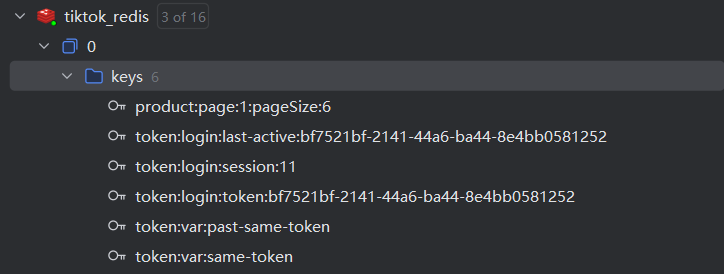
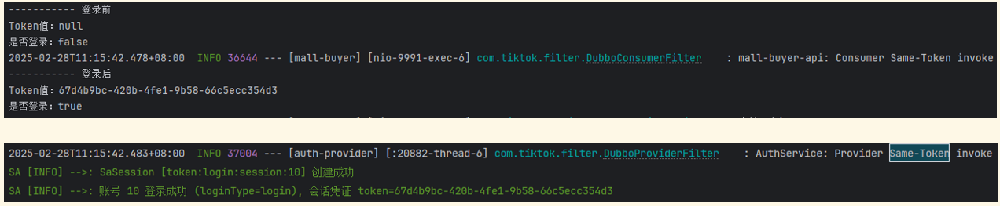
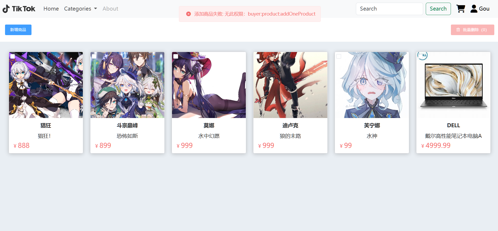

# 使用 Sa-Token 实现身份认证和权限认证

## 技术选型与相关开发文档

**[Sa-Token](https://sa-token.cc/index.html)** 是一个轻量级 Java 权限认证框架，主要解决：**登录认证**、**权限认证**、**单点登录**、**OAuth2.0**、**分布式Session会话**、**微服务网关鉴权** 等一系列权限相关问题。我们采用这个框架以实现仿抖音商场的登录认证和权限认证功能。我们采用的 Sa-Token 版本为 1.39.0。

我们将 Sa-Token 集成了 Redis 并适配了 dubbo。具体可参考以下文档：

* [在 SpringBoot 环境集成](https://sa-token.cc/doc.html#/start/example)
* [集成 Redis](https://sa-token.cc/doc.html#/up/integ-redis)

* [和 Dubbo 集成](https://sa-token.cc/doc.html#/plugin/dubbo-extend)

  

## 架构设计

* 服务总体架构：

  * 在 `mall-buyer-api`（各服务的 Controller 都在 mall-buyer-api 模块中）中增加拦截器，检验用户是否登录并对用户进行授权检查。
  * `AuthService` 提供登录（生成令牌）和登出（销毁令牌）功能。
  * `UserService` 中提供了用户登录时的密码校验和用户注册时存储用户信息的功能。

* **创建用户**：前端输入邮箱和密码，后端 `mall-buyer-api` 调用 `UserService` 存储邮箱和密码到 `User` 数据库中，并设置该用户的默认角色 为 user。

* **登录认证**：用户在前端输入邮箱和密码，后端 `mall-buyer-api` 首先调用 `UserService` 校验邮箱和密码，然后调用 `AuthService` 中的 `login` 函数为此次会话生成 Token，存储到 Redis 中（token:login:token:bf7521bf-2141-44a6-ba44-8e4bb0581252），如下图所示。然后，`mall-buyer-api` 从 Redis 读取该 Token 并返回给前端。前端接收并存储 Token，在访问其他接口时携带该 Token 以通过 `mall-buyer-api` 拦截器中的登录校验。

  

  下图显示了 `mall-buyer-api` 调用`AuthService` 中函数的过程：

  

* **权限认证**：由于我们开发的服务主要面向买家用户，我们设置了以下三个角色来控制权限。每个用户为以下三个角色中的一个。

  * user：默认的一般用户，拥有浏览商品、购买商品、增加收货地址、下单、支付、查看订单记录、大模型下单等权限。
  * admin：拥有 user 的所有权限，并拥有增加商品、删除商品的权限。
  * super-admin：拥有 admin 的所有权限，并拥有修改用户权限的权限（只能将用户角色修改为 user 或 admin）

  角色为 user 的用户无法增加商品、删除商品，如下图所示。

  

* **续期身份令牌**：Sa-Token 提供两种 Token 自动过期策略，分别是 `timeout` 与 `active-timeout`。`timeout`代表 Token 的长久有效期，`active-timeout`代表最低活跃频率。我们将 `timeout` 设置为 86400s， `active-timeout` 设置为 3600s。这样：

  * 在 86400s（1 day）后，Token 必定过期，无法继续使用。
  * 如果在 3600s（1 hour）用户有操作，则会再次续签 3600s，用户如果一直操作则会一直续签，直到连续 3600s 无操作，Token 才会过期（被冻结，但不会删除掉）。

  具体可参考 [Token有效期详解](https://sa-token.cc/doc.html#/fun/token-timeout)。

* **RPC 调用鉴权**：我们在 Dubbo 中如何集成了 Sa-Token 中的 Same-Token 模块以进行安全的 RPC 调用。具体来说，在调用端（Consumer）追加 Same-Token 参数，在被调用端（Provider）校验这个 Same-Token 参数。校验通过则调用成功；校验不通过则调用失败并抛出异常。由于已和 Redis 集成，Same-Token 也存储在 Redis 中。具体可参考 [和 Dubbo 集成](https://sa-token.cc/doc.html#/plugin/dubbo-extend?id=和-dubbo-集成)。

## 项目代码介绍

`AuthService` 模块：

* `com.tiktok.service.impl.AuthServiceImpl`：利用 Sa-Token 实现用户登录和登出功能。
* `com.tiktok.filter.DubboProviderFilter`：过滤器，对 Same-Token 进行校验。

* `com.tiktok.config.SaSameTokenRefreshTask`：定时刷新 Same-Token，保证其高可用。

`mall-buyer-api` 模块（与身份和权限认证相关的代码）

* `com.tiktok.config.SatokenPermissionConfiguration`：利用 Sa-Token 为角色分配权限。
* `com.tiktok.config.WebMvcConfiguration`：增加拦截器，对用户进行登录校验和权限校验。
* `com.tiktok.controller.UserController`：用户相关接口（登录，注册，退出登录，更新用户角色）。
* `com.tiktok.filter.DubboConsumerFilter`：过滤器，作为 Consumer 在调用其他服务时添加 Same-Token。

`UserService` 模块（与身份和权限认证相关的代码）：

* `com.tiktok.service.impl.UserServiceImpl`：查询数据库校验密码、注册、更改角色权限等相关功能。
* `com.tiktok.filter.DubboProviderFilter`：过滤器，对 Same-Token 进行校验。